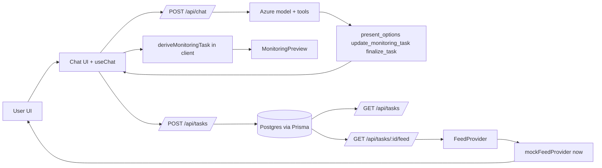
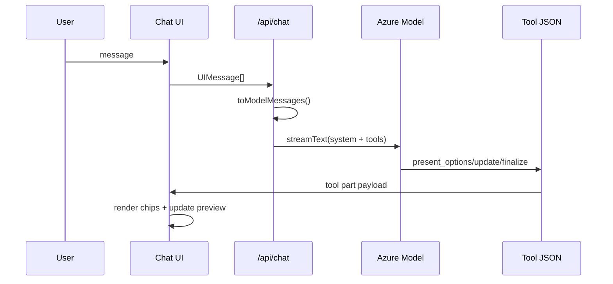

# Aim Monitor Architecture

## 0) Platform Baseline (Landing + Auth + Data)

- **App stack**: Next.js App Router + React + AI SDK + Prisma + PostgreSQL.
- **Landing entry**: `/` is public entry and sign-in surface.
- **OAuth**: NextAuth with GitHub provider.
- **Session model**: database session strategy, persisted in Postgres.
- **Adapter**: Prisma adapter binds NextAuth models to DB.
- **Protected workspace**: authenticated users redirect into `/dashboard`.

Key files:
- [`app/page.tsx`](../app/page.tsx)
- [`components/landing/LandingPage.tsx`](../components/landing/LandingPage.tsx)
- [`lib/auth.config.ts`](../lib/auth.config.ts)
- [`lib/auth.ts`](../lib/auth.ts)
- [`app/api/auth/[...nextauth]/route.ts`](../app/api/auth/[...nextauth]/route.ts)
- [`lib/prisma.ts`](../lib/prisma.ts)
- [`prisma/schema.prisma`](../prisma/schema.prisma)

## 1) Product UX Flow (what user sees)

1. Landing page (`/`) shows product story + sign-in CTA.
2. Authenticated user lands in dashboard (`/dashboard`) with all monitors.
3. User starts new monitor (`/dashboard/new`) via chat interview.
4. Agent asks structured follow-ups using clickable options.
5. Right panel shows live monitor spec preview while chat progresses.
6. Agent emits final summary; user confirms "Create Monitor".
7. Monitor detail (`/dashboard/monitors/[id]`) shows full spec + live (mock) feed timeline.

Key files:
- [`app/page.tsx`](../app/page.tsx)
- [`app/dashboard/page.tsx`](../app/dashboard/page.tsx)
- [`app/dashboard/new/page.tsx`](../app/dashboard/new/page.tsx)
- [`components/chat/ChatContainer.tsx`](../components/chat/ChatContainer.tsx)
- [`components/chat/MessageBubble.tsx`](../components/chat/MessageBubble.tsx)
- [`app/dashboard/monitors/[id]/page.tsx`](../app/dashboard/monitors/[id]/page.tsx)

---

## 2) High-Level Architecture



### Runtime layers

- **UI layer**: Next.js App Router pages + client components for chat, board, monitor detail.
- **Agent orchestration layer**: `streamText` with Azure Responses model + tool calls.
- **Persistence layer**: Prisma + Postgres `MonitoringTask`.
- **Feed layer**: provider interface + mock implementation, stable response contract.

Key files:
- [`app/api/chat/route.ts`](../app/api/chat/route.ts)
- [`lib/azure.ts`](../lib/azure.ts)
- [`lib/tools.ts`](../lib/tools.ts)
- [`lib/to-model-messages.ts`](../lib/to-model-messages.ts)
- [`prisma/schema.prisma`](../prisma/schema.prisma)
- [`lib/feeds/provider.ts`](../lib/feeds/provider.ts)
- [`lib/feeds/mock-provider.ts`](../lib/feeds/mock-provider.ts)

---

## 3) Monitoring Schema (and why this shape)

### Canonical task object used in app

Source: [`lib/types.ts`](../lib/types.ts)

```json
{
  "title": "string?",
  "scope": "string?",
  "keywords": ["string"],
  "entities": [
    {
      "type": "company | person | topic | product | ticker",
      "name": "string",
      "description": "string?"
    }
  ],
  "sources": [
    {
      "type": "web | news | social | sec | arxiv | rss | custom",
      "name": "string"
    }
  ],
  "frequency": "realtime | hourly | daily | weekly",
  "filters": {
    "language": "string?",
    "region": "string?",
    "minRelevance": "number?",
    "excludeKeywords": ["string"]
  }
}
```

### DB model (hybrid persistence)

Source: [`prisma/schema.prisma`](../prisma/schema.prisma)

- Stores full raw `config` JSON (compat, lossless payload).
- Also stores normalized columns (`scope`, `keywords`, `entities`, `sources`, `frequency`, `filters`, `summary`) for easier query/indexing.
- Write path fills normalized columns via normalization util.
- Read path can reconstruct from either normalized cols or legacy `config`.

Normalization + fallback logic:
- [`lib/task-spec.ts`](../lib/task-spec.ts)
- [`app/api/tasks/route.ts`](../app/api/tasks/route.ts)
- [`app/api/tasks/[id]/route.ts`](../app/api/tasks/[id]/route.ts)

### Why this schema

- **Flexible now**: product still iterating; raw `config` avoids migration pain.
- **Queryable later**: normalized cols support filters/sorting/reporting.
- **Safer evolution**: compatibility layer handles legacy DBs gracefully.
- **LLM-friendly**: optional fields + incremental updates match chat interview flow.

---

## 4) Agent Output Contract (structured, deterministic)

Model does not only return free text. It must call tools with JSON payloads.

Tool definitions:
- [`lib/tools.ts`](../lib/tools.ts)
- [`lib/tool-schemas.ts`](../lib/tool-schemas.ts)

### `present_options`

```json
{
  "question": "Which sources should we track?",
  "options": [
    { "label": "News", "value": "news", "description": "Major media and wires", "icon": "📰" },
    { "label": "SEC", "value": "sec", "description": "Filings and disclosures", "icon": "📄" }
  ],
  "allowMultiple": true
}
```

Used by UI to render deterministic chips, not ambiguous natural-language prompts.

### `update_monitoring_task`

```json
{
  "title": "NVIDIA regulatory and product signal monitor",
  "scope": "Track NVIDIA product launches and regulatory mentions",
  "keywords": ["NVIDIA", "GPU", "antitrust"],
  "entities": [
    { "type": "company", "name": "NVIDIA" },
    { "type": "topic", "name": "AI chips" }
  ],
  "sources": [
    { "type": "news", "name": "Reuters" },
    { "type": "sec", "name": "SEC filings" }
  ],
  "frequency": "daily",
  "filters": {
    "language": "en",
    "region": "US",
    "minRelevance": 0.75,
    "excludeKeywords": ["job posting"]
  }
}
```

UI merges these partial updates into live preview state.

### `finalize_task`

```json
{
  "summary": "Title: ... Scope: ... Entities tracked: ... Sources: ... Frequency: ..."
}
```

UI parses summary into review card, user confirms save.

### Tool-loop message mapping

The chat route converts UI messages into model message format with explicit `tool-call` and `tool-result` records.

Source: [`lib/to-model-messages.ts`](../lib/to-model-messages.ts)



Why this structure:
- predictable rendering
- schema validation
- easier persistence
- lower hallucination surface vs free-form parse

### Engineering method (TDD RGR)

- For agent-related logic, implementation followed Red-Green-Refactor.
- First step: add failing tests for message mapping and task-derivation behaviors.
- Second step: implement minimal logic to pass.
- Third step: refactor while keeping tests green.

Key tests:
- [`__tests__/lib/to-model-messages.test.ts`](../__tests__/lib/to-model-messages.test.ts)
- [`__tests__/lib/monitoring-utils.test.ts`](../__tests__/lib/monitoring-utils.test.ts)
- [`__tests__/lib/tools.test.ts`](../__tests__/lib/tools.test.ts)

---

## 5) System Prompt Definition

Source: [`lib/system-prompt.ts`](../lib/system-prompt.ts)

```text
You are an AI assistant that helps users create monitoring tasks. Your job is to interview the user conversationally to build a complete monitoring configuration.

Interview Flow:
1) Scope
2) Entities
3) Sources
4) Frequency
5) Filters (optional)

Rules:
- Always use present_options
- After every user response, call update_monitoring_task
- Call finalize_task when scope + at least 2 sources + frequency are defined
- Be concise
- Break broad requests into specific entities
- Suggest relevant sources
- Generate descriptive title

Important:
- Start by asking what they want to monitor
- Present 3-5 options when possible
- Include option descriptions when useful
- Always update task config incrementally
```

Why this prompt strategy:
- forces interview order
- enforces tool use (not just prose)
- keeps UX consistent across runs
- aligns completion gate with minimum usable monitor config

---

## 6) Feed Architecture (mock today, live-ready)

- Feed endpoint: `GET /api/tasks/[id]/feed`.
- Reads persisted monitor when exists + user authorized.
- Falls back to query-seeded task for previews.
- Calls provider interface, currently mock provider.
- UI polls every 15s using React Query.

Key files:
- [`app/api/tasks/[id]/feed/route.ts`](../app/api/tasks/[id]/feed/route.ts)
- [`lib/feeds/provider.ts`](../lib/feeds/provider.ts)
- [`lib/feeds/mock-provider.ts`](../lib/feeds/mock-provider.ts)
- [`lib/hooks/use-task-feed.ts`](../lib/hooks/use-task-feed.ts)
- [`components/monitoring/MonitorFeedPanel.tsx`](../components/monitoring/MonitorFeedPanel.tsx)

Why this split:
- provider swap later does not break UI/API contract
- deterministic mock data good for demos/tests
- stable response shape reduces integration risk

---

## 7) Trade-offs

- **Structured tools over free-form chat**: we trade some conversational flexibility for predictable UI, safer parsing, and lower operational risk.
- **Hybrid persistence (raw + normalized)**: we accept duplicated storage to get both schema agility and query-ready fields.
- **Polling over realtime sockets**: we trade immediacy for a simpler and more reliable v1 runtime.
- **Client-side preview derivation**: we get instant feedback in the builder, with the trade-off that source-of-truth exists only after save.
- **Mock feed provider first**: we move faster on UX and contracts now, while accepting that real relevance quality is still unproven.

---

## 8) One More Week: What to Build Next

1. Add real ingestion adapters (news/web/social) behind `FeedProvider`.
2. Add server-side evaluation pipeline for relevance + dedupe + source credibility.
3. Add monitor edit/versioning UI and change history.
4. Add alerting channels (email/Slack/webhook) and threshold rules.
5. Add telemetry dashboard: completion funnel, tool-call failure rate, latency, save conversion.
6. Add integration tests for full chat-to-save flow with fixed model fixtures.

---

## 9) Biggest Risks / Unknowns + Validation Plan

1. **Model output drift**
   - Risk: tool payload quality degrades as prompt distribution changes.
   - Validate: strict schema contract tests plus nightly regression prompt suites.
2. **Schema evolution breakage**
   - Risk: older monitors fail newer UI assumptions.
   - Validate: migration fixtures and backward-compat tests through `monitoringTaskFromStoredTask`.
3. **Live feed relevance quality**
   - Risk: noisy items reduce user trust and retention.
   - Validate: precision-at-k tracking with human relevance scoring.
4. **Interview funnel drop-off**
   - Risk: latency and step count reduce monitor completion.
   - Validate: step-level funnel instrumentation and latency-focused prompt tuning.
5. **Auth isolation failures**
   - Risk: cross-user task/feed access in edge routes.
   - Validate: route-level authorization tests across all task and feed APIs.

---

## 10) Key Files Index

| Area | File |
|---|---|
| Prompt | [`lib/system-prompt.ts`](../lib/system-prompt.ts) |
| Tool definitions | [`lib/tools.ts`](../lib/tools.ts) |
| Tool raw schemas | [`lib/tool-schemas.ts`](../lib/tool-schemas.ts) |
| UI->model mapping | [`lib/to-model-messages.ts`](../lib/to-model-messages.ts) |
| Runtime task derivation | [`lib/monitoring-utils.ts`](../lib/monitoring-utils.ts) |
| Task type schema | [`lib/types.ts`](../lib/types.ts) |
| Task normalization/fallback | [`lib/task-spec.ts`](../lib/task-spec.ts) |
| Chat API | [`app/api/chat/route.ts`](../app/api/chat/route.ts) |
| Task APIs | [`app/api/tasks/route.ts`](../app/api/tasks/route.ts), [`app/api/tasks/[id]/route.ts`](../app/api/tasks/[id]/route.ts) |
| Feed API | [`app/api/tasks/[id]/feed/route.ts`](../app/api/tasks/[id]/feed/route.ts) |
| Feed contracts | [`lib/feeds/types.ts`](../lib/feeds/types.ts), [`lib/feeds/provider.ts`](../lib/feeds/provider.ts) |
| Feed mock impl | [`lib/feeds/mock-provider.ts`](../lib/feeds/mock-provider.ts) |
| DB schema | [`prisma/schema.prisma`](../prisma/schema.prisma) |
